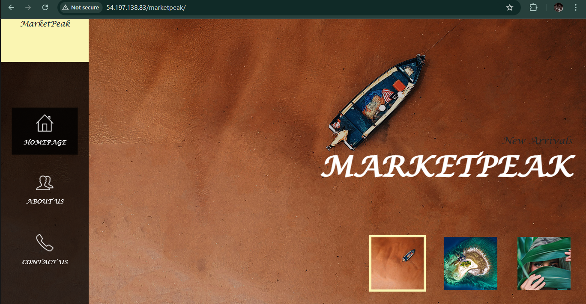

# E-Commerce Platform Deployment with Git, Linux and AWS

## MarketPeak Online 
This project involves developing an e-commerce website (using an already made template) for a new online marketplace. The objects of this project is to utilize Git for version control, develop the platform in a Linux environment and deploy it on an EC2 instance. 

## Initialize Git Repository using VSCode Terminal
1. **Navigate to `darey.io-training-project` Directory**
```bash
cd darey.io-training-project
```
2. **Create Directory**
-Create a new directory named *"MarketPeak_Ecommerce"*
```bash
mkdir MarketPeak_ Ecommerce
```
3. **Navigate to `MarketPeak_Ecommerce` Directory**
```bash
cd MarketPeak_Ecommerce
```
**Tip**: _Verify the working directory with `pwd` command to ensure you are in the right folder._

4. **Initialize Git reposiroty in new Directory**
```bash
git init
```
## Prepare E-commerce Website Template
1. Download a website template 
2. Prepare the website by extracting the downloaded template to the *"MarketPeak_Ecommerce"* Directory
 
## Create HTML file for website
1. **Create and add homepage, about us, contact page to index.html file** 
```bash
vim index.html
  <nav>
        <ul>
            <li><a href="#1"> <em>Homepage</em></a></li>
            <li><a href="#2"> <em>About Us</em></a></li>
            <li><a href="#4"> <em>Contact Us</em></a></li>
          </ul>
        </nav>
```
**Reminder**: _Save your changes in `vim` by typing `:wq` and pressing Enter._

## Stage and Commit website to Git
1. **Add website files to Git repository**
```bash
git add .
```
2. **Set Git global configuration with username and email
```bash
git config --global user.name "Tango9er"
git config --global user.email "davidegbo01@gmail.com"
```
3. **Commit changes to Git repository**
```bash
git commit -m "Initial commit with basic e-commerce site structure"
```
## Push code to GitHub repository
1. **Create a remote repository on GitHub**
    - **Sign in to [GitHub](https://github.com)**
    - Click on the `+` icon in the top right corner
    - Select **New repository**
    - Name repository *"MarketPeak_Ecommerce"*
    - Click **Create repository**
     **Note**: _Make sure your repository name is descriptive and relevant._

2. **Link local repository to GitHub**
```bash
git remote add origin https://github.com/Tango9er/MarketPeak_Ecommerce.git
```
3. **Push code to GitHub**
```bash
git push origin main
```

## AWS Deployment
To deploy *"MarketPeak_Ecommerce"* platform, start by setting up an Amazon EC2 instance.

1. **Deploy *"MarketPeak_Ecommerce"* on EC2 instance**
    - **Sign in to [AWSConsole](https://aws.amazon.com)**
    - Click on *"Sign in to the console"*

2. **Launch an EC2 instance**
    - Type **EC2** in the search bar located at top right
    - Click on *"Launch Instance"*
    - Name instance
    - Select Amazon Linux AMI
    - Create and download new keypair
    - Select security group
    - Click on *"Launch Instance"*

3. **Clone repository on Linux server**
    - Navigate to repository in GitHub
    - Select *"code"*
    - Click on *"HTTPS"* and copy url
    - Launch ssh client (MobaXterm)
    - Navigate to directory where keypair was downloaded
```bash
cd downloads 
 ssh -i "marketpeak.pem" ec2-user@54.197.138.83
 ```
4. **Using HTTPS to clone**
```bash
git clone https://github.com/Tango9er/MarketPeak_Ecommerce.git
```


## Install a web server on EC2 instance
1. **Install Apache HTTP Server (httpd)**
```bash
sudo yum update -y
sudo yum install httpd -y
sudo systemctl start httpd
sudo systemctl enable httpd
```
## Configure HTTPD for website
To serve the website from the EC2 instance, configure *httpd* to point to the directory on the Linux server where the website code files are stored. Usually in */var/www/html*.
 1. **Prepare the web directory**
 ```bash
sudo rm -rf /var/www/html/*
sudo cp -r ~/MarketPeak_Ecommerce/* /var/www/html/
```
**Tip**: _The directory `/var/www/html/` is a standard directory structure on the Linux system that host web content, particularly for the `Apache HTTP Server`. When you install Apache on a Linus system, the installation process automatically creates this directory._

2. **Reload httpd**
```bash
sudo systemctl reload httpd
```

## Access Website from browser
- Copy the public IP address of EC2 instance
- Open a web browser and paste IP address in the address bar 

## Continuous Integration and Deployment 
1. **Developing new features and fixes**
    - Create and switch to a new branch called *Development Branch*
```bash
git branch development
git checkout development
```
2. **Make changes to Index.html file**
```bash 
vim index.html
 <nav>
        <ul>
            <li><a href="#1"> <em>Homepage</em></a></li>
            <li><a href="#2"> <em>About Us</em></a></li>
            <li><a href="#3"> <em>Our Gallery</em></a></li>
            <li><a href="#4"> <em>Contact Us</em></a></li>
          </ul>
        </nav>
```
**Reminder**: _Save your changes in `vim` by typing `:wq` and pressing Enter._

3. **Stage, Commit and Push new changes**
```bash
git add .
git commit -m "Add Gallery"
git push origin development
```
**Reminder**: _`Create a Pull Request` in GitHub to merge the development branch into the main branch._

4. **Review and Merge Pull Request**
Once the changes have been reviewed and confirm satisfactory, merge the pull request into the main branch to incorporate the new changes.
```bash
git checkout main
git merge development
```
5. **Push Merged changes to GitHub**
```bash
git push origin main
```
**Reminder**: _Ensure local main branch is updated with new changes before pushing to remote repository on GitHub._

## Deploying Updates to Server
1. **Pull latest changes on server**
```bash
ssh -i "marketpeak.pem" ec2-user@54.144.119.164
cd downloads
git pull origin main
sudo systemctl reload httpd
```
**Tip**: *Ensure to restart the web server*

2. **Test new changes**
    - Navigate to IP address of EC2 instance and copy it.
    - Open web browser and paste IP address in the address bar. 
    - Check new changes to see if they have been effected.
    
    


